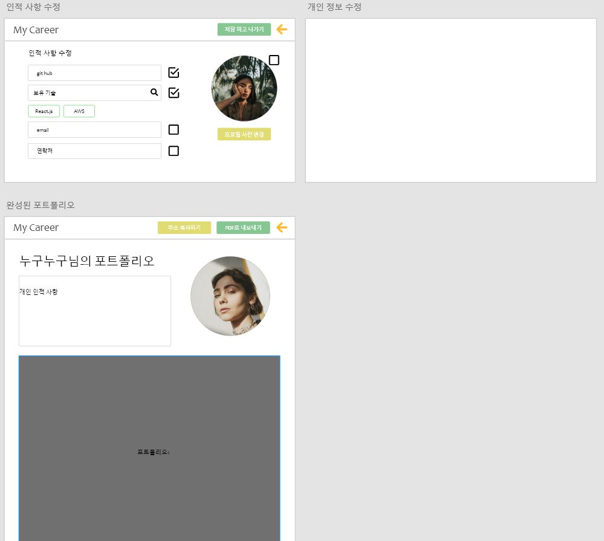
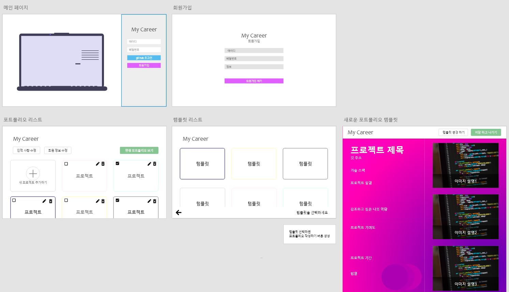
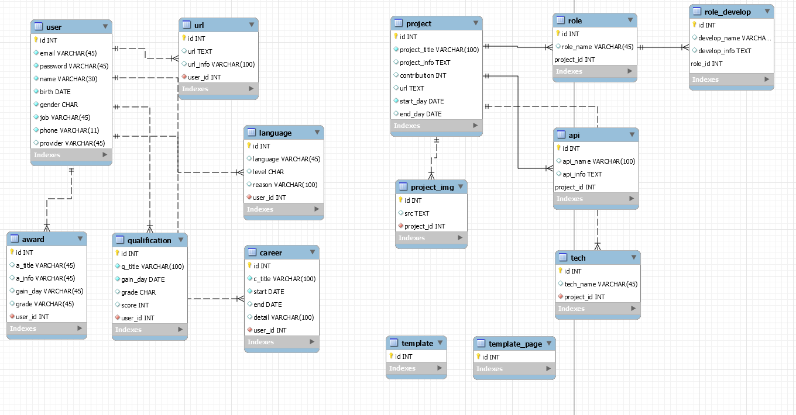

# 마커(My Career)

### 포트폴리오 템플릿 작성 사이트

---

> ### Develop Environment

1. ##### Front - end

   + 

2. ##### Back - end

   + 

> ### Rule

1. ##### Git

   + Commit

     `[연월일 이름] 수정한 내용`

     ex ) [20200518 홍길동] Login 수정 
     
   + Branch

     + Master -> Develop -> Frontend, Backend
       + `frontend/기능`
       + `backend/기능`

2. ##### JIRA

   + Issue 생성 시, [백엔드 || 프론트엔드]를 어두에 붙이기
   
     `[프론트엔드 || 백엔드] Issue`

> #### WireFrame

> ### Frontend

1. Frontend 진행 상황
    + [Frontend-ReadMe](frontend/README.md)

> ### Backend

1. ##### ERD

   

   + DB 수정 사항

     + TABLE ID 컬럼을 TABLE에 맞게 TABLENAME_ID로 수정할 예정
     + Template 관련 사항 미구현 -> 구현 예정
     + Created_at 등의 Date 관련 컬럼 추가 예정

   + Front와 rest api 연결을 본격적으로 진행하게 되면, 상황에 맞추어 수정할 예정

     

2.  Backend 진행 상황

   + [Backend-ReadMe](backend/README.md)
