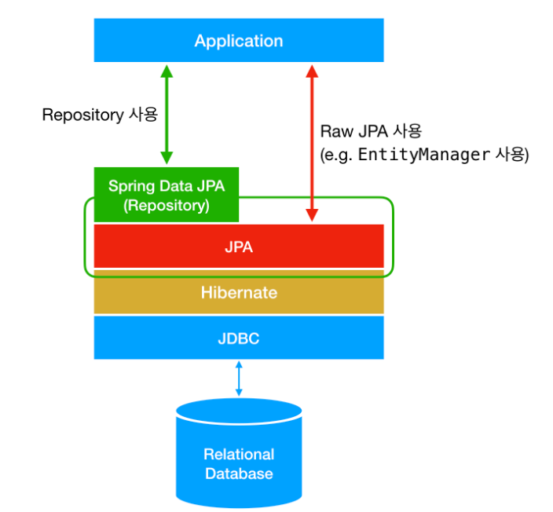

# JPA

> ### JPA(Java Persistence API)

+ DB 테이블과 JAVA 객체 사이의 Mapping을 처리해주는 ORM이란 기술의 표준.

  + ORM : Object-relational mapping. 객체 관계 매핑
    + 객체는 객체대로 설계, 관계형 데이터베이스는 데이터베이스대로 설계.
    + ORM 프레임워크가 중간에서 매핑해준다.

  

+ **사용하는 이유?**

  + 생산성
    + 자바 컬렉션에 객체를 저장하는 JPA에게 객체를 전달
    + INSERT SQL 등의 JDBC API 사용하는 지루하고 반복적인 일을 JPA가 대신 처리
    + CREATE TABLE 같은 DDL문 자동 생성
    + 데이터베이스 중심 설계 -> 객체 중심 설계
  + 유지보수
    + 엔티티에 필드 추가 시 등록, 수정, 조회 관련 코드를 JPA가 일괄처리
    + 개발자가 작성할 SQL, JDBC API 코드를 JPA가 처리하여 유지보수에 필요한 코드 수를 줄임
  + 패러다임 불일치 해결
    + 상속, 연관관계, 객체 그래프 탐색, 비교 등의 불일치 해결
  + 성능
    + 다양한 성능 최적화 기회 제공


> ### Spring Data JPA

  스프링 프레임워크에서 JPA를 편리하게 사용할 수 있도록 지원하는 프로젝트

  데이터 접근 계층을 개발할 때, 구현 클래스 없이 인터페이스만 작성해도 개발할 수 있다.


+ **개념**
  + 


+ **사용법**

  + 의존성 추가

    ```xml
    <dependency>
      <groupId>org.springframework.data</groupId>
      <artifactId>spring-data-jpa</artifactId>
      <version>1.10.1.RELEASE</version>
    </dependency>
    ```

  + Spring data jpa 적용 예시

    ```java
    @Repository
    public interface UserRepository extends JpaRepository<User, Integer>{
    	User findByUserId(int userId);
    }
    ```

    + JpaRepository < Dto, Primary Key>

      + Dto에는 mapping할 entity 클래스, 뒤에는 클래스의 @id 자료형.

      

  + 주요 메서드

    | 메소드      | 설명                                                         |
    | ----------- | ------------------------------------------------------------ |
    | save(S)     | 새로운 엔티티를 저장하고, 이미 있는 엔티티는 수정            |
    | delete(T)   | 엔티티 하나를 삭제. 내부에서 EntityManager.remove() 호출     |
    | findOne(ID) | 엔티티 하나를 조회. 내부에서 EntityManager.find() 호출       |
    | getOne(ID)  | 엔티티를 프록시에서 조회. 내부에서 EntityManager.getReference() 호출 |
    | findAll     | 모든 엔티티 조회. 정렬이나 페이징 조건 파라미터를 제공할 수 있다. |

  + repository 명명 규칙

    + findByColumn(parameter) : 해당하는 칼럼을 입력하면 엔티티에서 컬럼을 where 조건으로 select 한다.
    + 한 건 이상 반환 : 컬렉션 타입
      + 조회 결과가 없을 경우 : 빈 컬렉션
    + 한 건만 반환 : 반환 타입을 지정
      + 조회 결과가 없을 경우 : null

+ **성능 최적화 기능**

  + 읽을 때 쓰는 캐시 기능

    + ```java
      String memberId = "100"; 
      Member m1 = jpa.find(Member.class, memberId); // SQL 
      Member m2 = jpa.find(Member.class, memberId); // 캐시 (SQL 1번만 실행, m1을 가져옴)
      println(m1 == m2) // true
      
      ```

      + 결과적으로, SQL을 한 번만 실행.

      

  + 모아서 쓰는 버퍼링 기능

    + ```java
      // Insert
      
      /** 1. 트랜잭션을 커밋할 때까지 INSERT SQL을 모음 */
      transaction.begin();  // [트랜잭션] 시작
      em.persist(memberA); 
      em.persist(memberB); 
      em.persist(memberC); 
      // -- 여기까지 INSERT SQL을 데이터베이스에 보내지 않는다.
      // 커밋하는 순간 데이터베이스에 INSERT SQL을 모아서 보낸다. --
      /** 2. JDBC BATCH SQL 기능을 사용해서 한번에 SQL 전송 */
      transaction.commit(); // [트랜잭션] 커밋
      
      // Update
      
      /** 1. UPDATE, DELETE로 인한 로우(ROW)락 시간 최소화 */
      transaction.begin();  // [트랜잭션] 시작
      changeMember(memberA);  
      deleteMember(memberB);  
      비즈니스_로직_수행();     // 비즈니스 로직 수행 동안 DB 로우 락이 걸리지 않는다.    
      // 커밋하는 순간 데이터베이스에 UPDATE, DELETE SQL을 보낸다.
      /** 2. 트랜잭션 커밋 시 UPDATE, DELETE SQL 실행하고, 바로 커밋 */
      transaction.commit(); // [트랜잭션] 커밋
      
      
      ```

      + 트랜잭션을 COMMIT할 때 까지는 INSERT SQL을 메모리에 쌓음.

        -> 3번의 INSERT를 한 번에 처리

      + Update, Delete로 인한 Row 락 시간을 최소화

      

    + 즉시로딩(FetchType - EAGER)

      + 엔티티를 조회할 때, 연관된 엔티티를 즉시 조인해서 값을 넣어준다.

    + 지연로딩(FetchType - LAZY)

      + 엔티티를 조회할 때, 연관된 엔티티를 조인하지 않는다. 즉, 값을 넣지 않는다.
      + 참조하고 싶을 때는, 조인 쿼리를 작성하여 값을 넣을 수 있다.

    

     

  + **개념 정리**

    + ```java
      @Entity
      @Table(name="user")
      @AllArgsConstructor
      @NoArgsConstructor
      @Getter
      @ToString
      public class User {
      	
      	@Id
      	@GeneratedValue(strategy = GenerationType.IDENTITY)
      	@Column(name="id")
      	Integer userId;
      	
      ```

      + @Entity
        + JPA에서 관리할 객체 선언 
        + 필드에 final, enum, interface, class 사용 불가
      + @Table(name = "table_name")
        + DB에 저장되 있는 테이블과 매핑한다.
        + name : 매핑할 테이블의 이름 지정
        + catalog : db의 catalog를 mapping
        + schema : db의 스키마와 mapping
      + @Id
        + Table 객체의 기본키
      + @Column
        + 객체 필드와 DB 테이블의 컬럼을 Mapping
        + name : 컬럼의 이름
        + insertable : 엔티티 저장 시 선언된 필드도 같이 저장
        + updateable : 엔티티 수정 시 이 필드도 같이 수정
        + table : 지정한 필드를 다른 테이블에 mapping
        + nullable : null 허용/불가
        + 