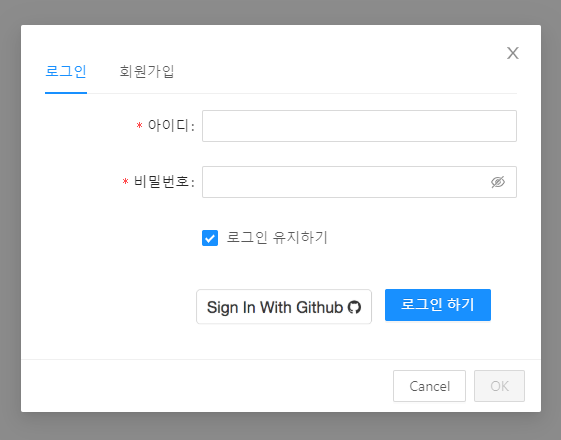
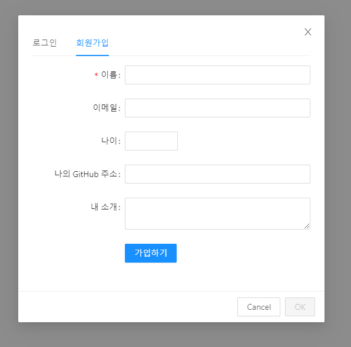
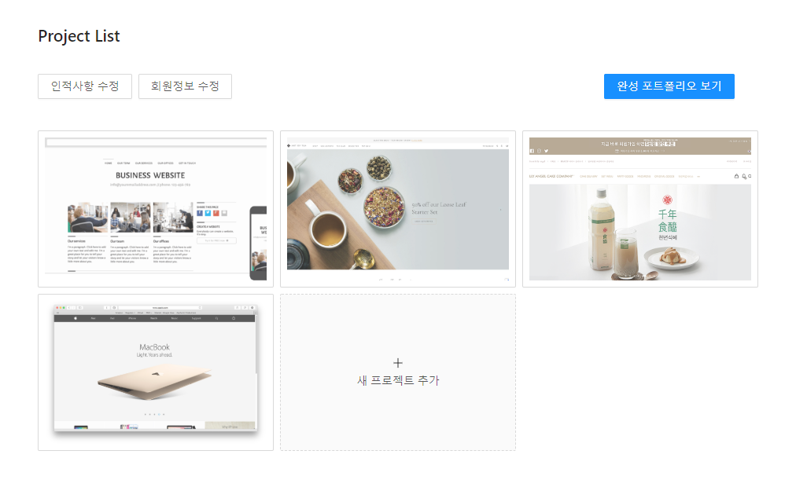

# MyCareer

## frontend

## Getting Started
> s02p31a103/frontend/mycareer 경로에서 해당 명령문을 입력해주세요.
```
npm install
```

### ✅ Sign In & Sign Up ✅




- 로그인 버튼을 누르면 모달창으로 표시되며 탭하여 회원가입으로 이동할 수 있습니다.
- 깃허브 소셜로그인을 구현할 예정입니다.

### Project List



- 수행한 프로젝트들을 추가할 수 있습니다.
- 새 프로젝트 버튼을 누를 시 템플릿에 따라 프로젝트를 작성할 수 있으며, 작성 완료 후 목록에는 프로젝트의 대표 이미지로 표시됩니다.
- 드래그 하여 순서를 바꿀 수 있는 기능도 구현할 예정입니다.

- 완성된 포트폴리오 보기를 누르면 추가한 프로젝트들로 구성이 되어있는 포트폴리오를 확인할 수 있습니다.