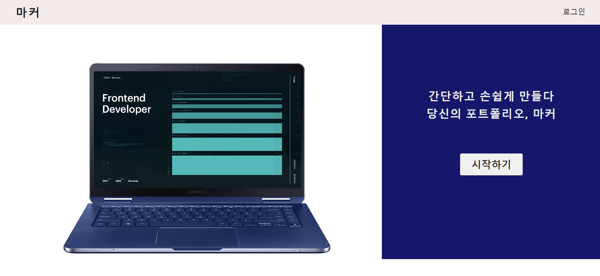
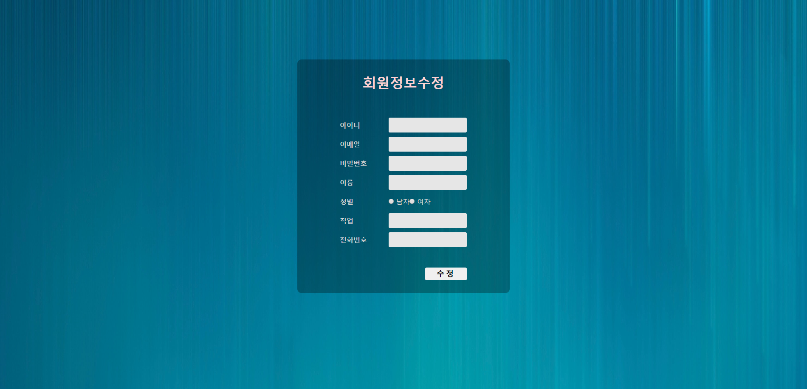
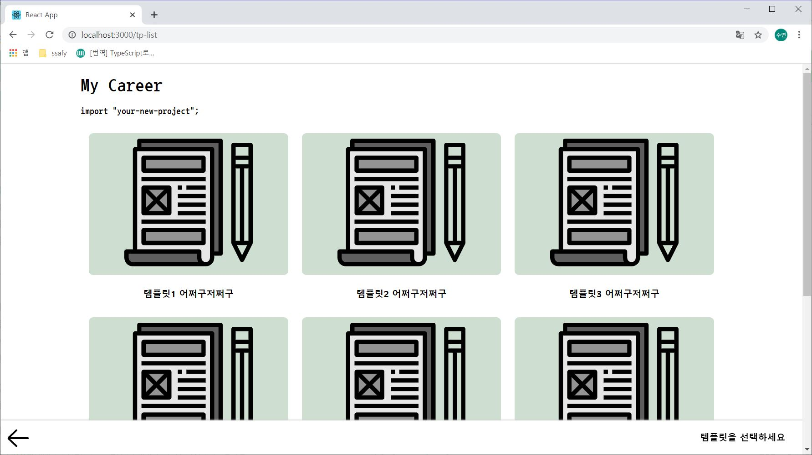
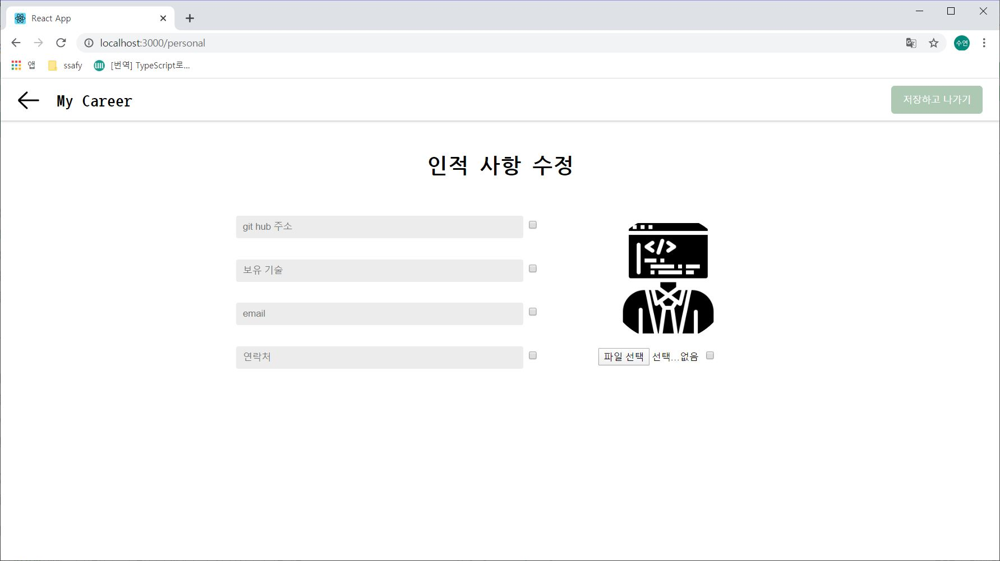
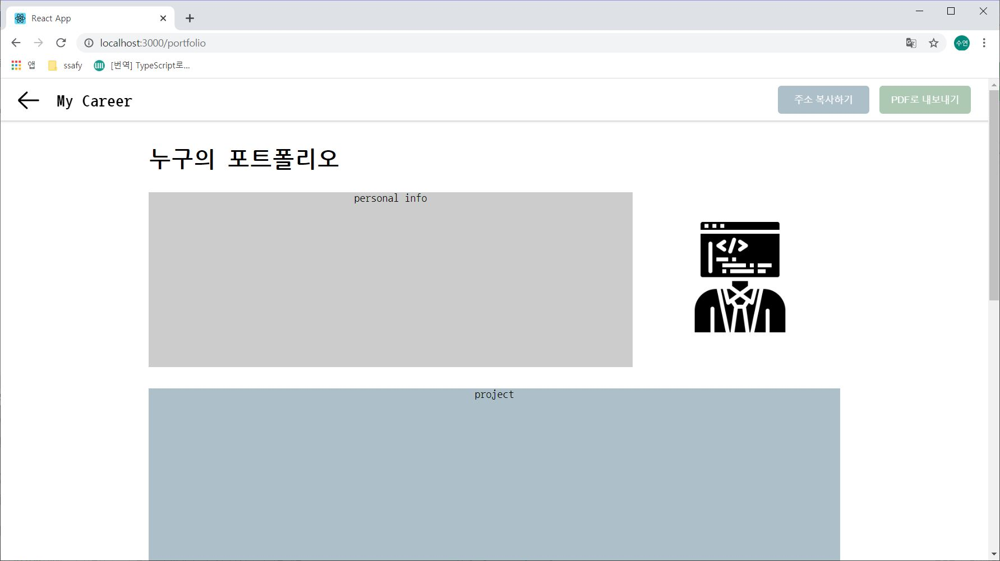

# MyCareer

## frontend

## 🔥 Getting Started
> s02p31a103/frontend/mycareer 경로에서 해당 명령문을 입력해주세요.
```
npm install
```

## 목차
[메인 화면](#메인화면-(main))

### 메인화면 (Main)



- 메인화면으로 저희 서비스의 내용과 사용방법등을 확인할 수 있습니다.
- 시작하기 버튼을 눌러 서비스를 시작할 수 있습니다.

### ✅ Sign In & Sign Up


- 로그인 버튼을 누르면 모달창으로 표시되며 탭하여 회원가입으로 이동할 수 있습니다.
- 깃허브 소셜로그인을 구현할 예정입니다.

### User Info



- 회원정보 확인 및 수정을 할 수 있습니다.

### 🎨 Project List


- 수행한 프로젝트들을 추가할 수 있습니다.
- 새 프로젝트 버튼을 누를 시 템플릿에 따라 프로젝트를 작성할 수 있으며, 작성 완료 후 목록에는 프로젝트의 대표 이미지로 표시됩니다.
- 드래그 하여 순서를 바꿀 수 있는 기능도 구현할 예정입니다.

- 완성된 포트폴리오 보기를 누르면 추가한 프로젝트들로 구성이 되어있는 포트폴리오를 확인할 수 있습니다.

### Template List


- 프로젝트를 포트폴리오에 추가하기 위해 템플릿을 선택합니다.
- 원하는 템플릿을 선택하면 작성하기 버튼이 생성되도록 구현할 예정입니다.

### Personal Information


- 유저의 인적 사항을 작성합니다.
- 각 항목은 최종적으로 완성할 포트폴리오에 추가할지 삭제할지 선택할 수 있습니다.

### Portfolio


- 유저의 인적사항과 작성한 프로젝트를 모두 한 페이지에 보여줍니다.
- URL 복사 버튼을 이용하여 손쉽게 완성된 포트폴리오를 공유할 수 있습니다.
- PDF로 내보내기 기능을 통해 파일로도 저장 가능하게 구현할 예정입니다.
